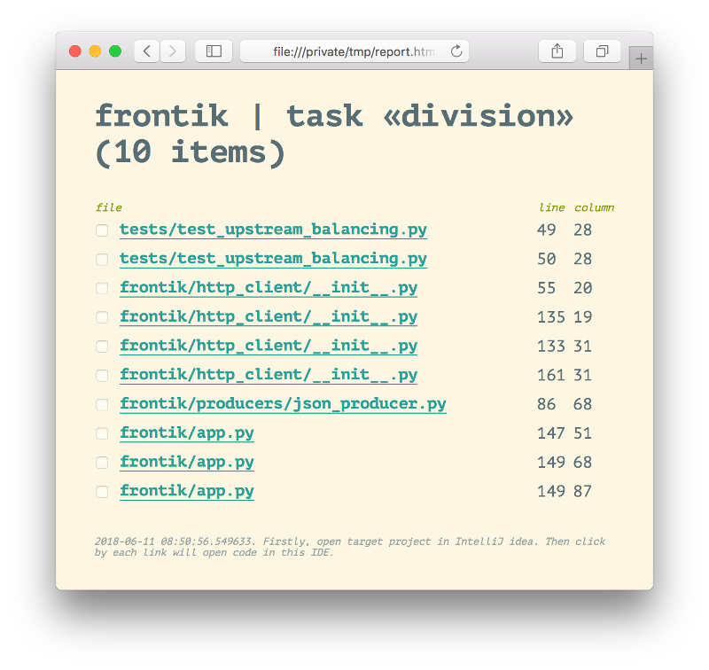

# Python refactoring helper

> A tool for easy refactoring

1. Find all python-files in some path (usually, your project)
2. Parse each file as AST
3. Find in AST cases for current task
4. Make html-report with all using cases, open it in browser
5. By click on each link open this file in IntelliJ idea at current linenumber

### Installing:

```shell
git clone https://github.com/vera-l/python-refhelper.git
cd python-refhelper
python setup.py install --user
```

### Using:

```
pyrefhelper [path] [task=list|division|rounding]
```

### Available tasks:

* `list` - get all python files
* `division` - find division cases in all python files
* `rounding` - find rounding cases in all python files
* `your_task` - you can add own tasks

### Report example:


